# 🤖 Local AI Mock Interviewer

A production-grade, highly optimized local mock interviewing platform. Practice frontend, backend, fullstack, DSA, and system design interviews entirely on your local machine.

Driven by local LLMs via **Ollama**, this platform operates with sub-second text streaming, parallel evaluation, and adaptive difficulty, requiring zero internet access or cloud API keys.

---

## ✨ Core Features

*   **⚡ Dual LLM Concurrency (Parallel Execution)**: Utilizes `Promise.all` to execute the interviewer text stream and answer evaluator synchronously. Latency is limited to the fastest response path.
*   **🌊 Real-Time Chunk Streaming**: Uses a native Web Stream API reader to stream words into the chat UI chunk-by-chunk for an instant, interactive feel like ChatGPT.
*   **🎯 Adaptive Difficulty Multiplier**:
    *   Tracks candidate performance on each question.
    *   Excellent answers increase the difficulty multiplier ($+0.2$, max $2.0$), instructing the AI to challenge you on advanced design and scale edge-cases.
    *   Stumbles shift the multiplier downwards ($-0.1$, min $0.5$), bringing the AI back to core technical foundations.
*   **📊 Parallel Diagnostics & Scoring**: Evaluates answers silently across 4 categories: *Technical Accuracy*, *Concept Depth*, *Clarity*, and *Confidence*, checking for conceptual flags (e.g. shallow answers, buzzword-dropping).
*   **📈 Telemetry & Historic Dashboard**: Interactive candidate workspace featuring Recharts charts, weakness logs, scoring trends, and historic scorecard reviews.
*   **🔒 100% Local & Private**: No cloud API keys, no monthly token bills, and zero data leakage. All data stays securely on your own machine.

---

## 🛠️ Tech Stack

*   **Framework**: Next.js 14 (App Router) & TypeScript
*   **Styling & Animations**: TailwindCSS & Framer Motion
*   **Database**: MongoDB & Mongoose
*   **Authentication**: NextAuth.js stable (Credentials Provider)
*   **Local AI Client**: OpenAI SDK pointing to local Ollama API
*   **Local Model**: `gemma2:2b` (extremely fast, low memory footprint, ideal for CPU-based local execution)
*   **State Management**: Zustand
*   **Charts & Visualization**: Recharts

---

## 🚀 Setup & Installation

### 1. Prerequisites
Ensure you have the following installed on your machine:
*   [Node.js](https://nodejs.org/) (v18+) or [Bun](https://bun.sh/)
*   [MongoDB Community Server](https://www.mongodb.com/try/download/community) (running locally on `mongodb://localhost:27017`)
*   [Ollama](https://ollama.com/)

### 2. Download and Start the Model
Pull the ultra-responsive `gemma2:2b` model:
```bash
# Pull the model
ollama pull gemma2:2b

# Start the Ollama local service
ollama serve
```

### 3. Clone and Install Dependencies
```bash
# Install packages
bun install
# OR: npm install
```

### 4. Configure Environment Variables
Create a `.env.local` file in the root directory:
```env
# Database configuration
MONGODB_URI=mongodb://localhost:27017/aimock

# NextAuth configuration
NEXTAUTH_SECRET=your_generated_secure_32_byte_secret
NEXTAUTH_URL=http://localhost:3000

# Ollama local instance settings
OLLAMA_BASE_URL=http://localhost:11434
OLLAMA_MODEL=gemma2:2b
```

### 5. Launch the Application
```bash
# Start Next.js development server
bun run dev
# OR: npm run dev
```
Open [http://localhost:3000](http://localhost:3000) in your browser!

---

## 🏗️ Architectural Flow

```mermaid
sequenceDiagram
    autonumber
    actor Candidate as User UI
    participant Route as Next.js API Route (/api/interview/answer)
    participant Ollama as Ollama Service (gemma2:2b)
    participant DB as MongoDB Database

    Candidate->>Route: Submit Answer (Session ID + Text)
    Note over Route: Prepares Concurrent Pipelines
    rect rgb(30, 41, 59)
        Note over Route: Promise.all Execution
        Route-->>Ollama: Pipeline 1: evaluateAnswer()
        Route-->>Ollama: Pipeline 2: streamInterviewerResponse()
    end
    Ollama-->>Route: Return Evaluation Scores (JSON)
    Ollama-->>Route: Stream first chat chunk (Text Stream)
    Route->>Candidate: Return Stream response (Pure raw text stream)
    
    loop Real-time stream
        Route->>Candidate: Stream next chunks
    end

    Note over Route: Stream Complete (onCompletion)
    Route->>DB: Save User Answer, Interviewer Question, and evaluation metrics
    Route->>DB: Save adjusted difficulty multiplier
```



---

## 💡 Developer Optimizations Applied

1.  **Concurrently Resolved Pipelines**: Replaced serial LLM operations with standard concurrent Promise calls.
2.  **Web Stream Interceptor**: Replaced Vercel AI SDK `StreamingTextResponse` protocol wrapping with native plain-text stream controllers. This fixed formatting artifacts like `0:"text"` appearing in chat bubbles.
3.  **Low-Latency Small Model**: Swapped to the highly optimized `gemma2:2b` model. This drops CPU response latency to **1-2 seconds**, ensuring the app remains perfectly snappy on ordinary development machines.
